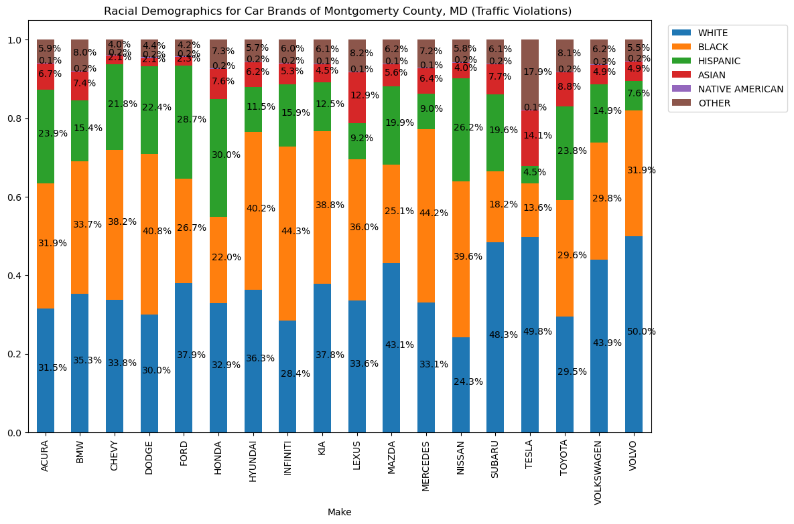

# Montgomerty County, Maryland - Traffic Violation Data Analysis

### Data Sourced from Montgomerty County, Maryland of all electronic traffic violations. Using the vehicle data and the information that describes attributes of the violation and the offender, we can assess a variety of questions categorizing what car brands and drivers are up to. 

## Data Loading and Cleaning 


```python
import numpy as np
import pandas as pd                # to import data
import seaborn as sns              # to visualize
import matplotlib.pyplot as plt
```


```python
df = pd.read_csv('Traffic_Violations.csv')
df.isnull().sum()                   # total missing values in each var

```


    SeqID                            0
    Date Of Stop                     0
    Time Of Stop                     0
    Agency                           0
    SubAgency                        0
    Description                     10
    Location                         4
    Latitude                         0
    Longitude                        0
    Accident                         0
    Belts                            0
    Personal Injury                  0
    Property Damage                  0
    Fatal                            0
    Commercial License               0
    HAZMAT                           0
    Commercial Vehicle               0
    Alcohol                          0
    Work Zone                        0
    Search Conducted            720509
    Search Disposition         1814062
    Search Outcome              739777
    Search Reason              1814062
    Search Reason For Stop      720787
    Search Type                1814070
    Search Arrest Reason       1840757
    State                           59
    VehicleType                      0
    Year                         10403
    Make                            68
    Model                          213
    Color                        21713
    Violation Type                   0
    Charge                           0
    Article                      86630
    Contributed To Accident          0
    Race                             0
    Gender                           0
    Driver City                    481
    Driver State                    11
    DL State                       929
    Arrest Type                      0
    Geolocation                      0
    dtype: int64


```python
## Dropping unnecessary Columns that have excessive missing values
df.drop(df.columns[[0,2,3,4,5,7,8,19,20,21,22,23,24,25,31,34,42]], axis=1,inplace=True)
df.isnull().sum()  
df = df.dropna()
```

#### This is a huge dataset with many user inputs that result in Na values. I removed columns with a large amount of missing data that I couldn't find a use for anyway.  


```python
df.info()
```

    <class 'pandas.core.frame.DataFrame'>
    Int64Index: 1886923 entries, 0 to 1898950
    Data columns (total 26 columns):
     #   Column                   Dtype  
    ---  ------                   -----  
     0   Date Of Stop             object 
     1   Location                 object 
     2   Accident                 object 
     3   Belts                    object 
     4   Personal Injury          object 
     5   Property Damage          object 
     6   Fatal                    object 
     7   Commercial License       object 
     8   HAZMAT                   object 
     9   Commercial Vehicle       object 
     10  Alcohol                  object 
     11  Work Zone                object 
     12  State                    object 
     13  VehicleType              object 
     14  Year                     float64
     15  Make                     object 
     16  Model                    object 
     17  Violation Type           object 
     18  Charge                   object 
     19  Contributed To Accident  bool   
     20  Race                     object 
     21  Gender                   object 
     22  Driver City              object 
     23  Driver State             object 
     24  DL State                 object 
     25  Arrest Type              object 
    dtypes: bool(1), float64(1), object(24)
    memory usage: 376.1+ MB
    

#### Variables are mostly Categorical type, so not much statistics can be created with the data, but we can still graph and analyze relationships between variables. 


```python
#Standardizing User input car makes to major brands 
Make = df["Make"]
Toyota = Make.str.contains("TOY")
Honda = Make.str.contains("HON")
Mazda = Make.str.contains("MAZ")|Make.str.contains("MZD")
Nissan = Make.str.contains("NISS")
Subaru = Make.str.contains("SUB")
Infiniti = Make.str.contains("INF")
Lexus = Make.str.contains("LEX")
Acura = Make.str.contains("AC")
Hyundai = Make.str.contains("HYUN")
Kia = Make.str.contains("KIA")
Dodge = Make.str.contains("DOD")
Chevy = Make.str.contains("CH")
Ford = Make.str.contains("FOR")
Volkswagen = Make.str.contains("VOLK")|Make.str.contains("WAG")
Mercedes = Make.str.contains("MER")|Make.str.contains("BEN")|Make.str.contains("GLC300")
BMW = Make.str.contains("BMW")
Volvo = Make.str.contains("VOLV")
Tesla = Make.str.contains("TES")


```


```python
df["Make"] = np.where(Toyota, "TOYOTA", np.where(Honda, "HONDA",np.where(Mazda, "MAZDA", np.where(Nissan, "NISSAN",
np.where(Subaru, "SUBARU", np.where(Infiniti, "INFINITI", np.where(Lexus, "LEXUS", np.where(Acura, "ACURA",np.where(Hyundai, "HYUNDAI",
np.where(Kia, "KIA",np.where(Dodge, "DODGE",np.where(Chevy, "CHEVY",np.where(Ford, "FORD",np.where(Volkswagen, "VOLKSWAGEN",
np.where(Mercedes, "MERCEDES",np.where(BMW, "BMW",np.where(Volvo,"VOLVO",np.where(Tesla,"TESLA", pd.NaT ))))))))))))))))))
df["Make"].tail()
```


    1898946     CHEVY
    1898947     HONDA
    1898948    TOYOTA
    1898949    TOYOTA
    1898950     ACURA
    Name: Make, dtype: object


#### It was necessary to standardize user input Car Makes, to work with and assess the data. Then I dropped entries that were not picked up by these major brand variables I created, which leads to a loss of 241,384 cases or about 12.71% of all cases, but still leaving us with a very large and more organized data set from which to analyze. 


```python
df = df.dropna()
```


```python
df[["Make", "Model"]].head(100)
```


<div>
<style scoped>
    .dataframe tbody tr th:only-of-type {
        vertical-align: middle;
    }

    .dataframe tbody tr th {
        vertical-align: top;
    }

    .dataframe thead th {
        text-align: right;
    }
</style>
<table border="1" class="dataframe">
  <thead>
    <tr style="text-align: right;">
      <th></th>
      <th>Make</th>
      <th>Model</th>
    </tr>
  </thead>
  <tbody>
    <tr>
      <th>0</th>
      <td>CHEVY</td>
      <td>CRUZ</td>
    </tr>
    <tr>
      <th>1</th>
      <td>TOYOTA</td>
      <td>COROLLA</td>
    </tr>
    <tr>
      <th>2</th>
      <td>TOYOTA</td>
      <td>COROLLA</td>
    </tr>
    <tr>
      <th>3</th>
      <td>TOYOTA</td>
      <td>HB</td>
    </tr>
    <tr>
      <th>4</th>
      <td>SUBARU</td>
      <td>ECLIPSE CROSS</td>
    </tr>
    <tr>
      <th>...</th>
      <td>...</td>
      <td>...</td>
    </tr>
    <tr>
      <th>100</th>
      <td>BMW</td>
      <td>X6</td>
    </tr>
    <tr>
      <th>106</th>
      <td>HONDA</td>
      <td>CRV</td>
    </tr>
    <tr>
      <th>107</th>
      <td>HONDA</td>
      <td>CRV</td>
    </tr>
    <tr>
      <th>108</th>
      <td>HONDA</td>
      <td>CIVIC</td>
    </tr>
    <tr>
      <th>109</th>
      <td>HONDA</td>
      <td>CIVIC</td>
    </tr>
  </tbody>
</table>
<p>100 rows × 2 columns</p>
</div>


```python
#Creating a Month Column 
df["Month"] = df['Date Of Stop'].str[0:2]
df["Month"] = df["Month"].astype(int)
df.head(5)
```


<div>
<style scoped>
    .dataframe tbody tr th:only-of-type {
        vertical-align: middle;
    }

    .dataframe tbody tr th {
        vertical-align: top;
    }

    .dataframe thead th {
        text-align: right;
    }
</style>
<table border="1" class="dataframe">
  <thead>
    <tr style="text-align: right;">
      <th></th>
      <th>Date Of Stop</th>
      <th>Location</th>
      <th>Accident</th>
      <th>Belts</th>
      <th>Personal Injury</th>
      <th>Property Damage</th>
      <th>Fatal</th>
      <th>Commercial License</th>
      <th>HAZMAT</th>
      <th>Commercial Vehicle</th>
      <th>...</th>
      <th>Violation Type</th>
      <th>Charge</th>
      <th>Contributed To Accident</th>
      <th>Race</th>
      <th>Gender</th>
      <th>Driver City</th>
      <th>Driver State</th>
      <th>DL State</th>
      <th>Arrest Type</th>
      <th>Month</th>
    </tr>
  </thead>
  <tbody>
    <tr>
      <th>0</th>
      <td>05/01/2023</td>
      <td>BRIGGS CHANEY RD @ COLUMIBA PIKE</td>
      <td>No</td>
      <td>No</td>
      <td>No</td>
      <td>No</td>
      <td>No</td>
      <td>No</td>
      <td>No</td>
      <td>No</td>
      <td>...</td>
      <td>Citation</td>
      <td>13-401(b1)</td>
      <td>False</td>
      <td>WHITE</td>
      <td>M</td>
      <td>GAITHERSBURG</td>
      <td>MD</td>
      <td>MD</td>
      <td>A - Marked Patrol</td>
      <td>5</td>
    </tr>
    <tr>
      <th>1</th>
      <td>11/25/2023</td>
      <td>GEORGIA AVE / WEISMAN RD</td>
      <td>No</td>
      <td>No</td>
      <td>No</td>
      <td>No</td>
      <td>No</td>
      <td>No</td>
      <td>No</td>
      <td>No</td>
      <td>...</td>
      <td>Citation</td>
      <td>13-409(b)</td>
      <td>False</td>
      <td>HISPANIC</td>
      <td>M</td>
      <td>SILVER SPRING</td>
      <td>MD</td>
      <td>MD</td>
      <td>A - Marked Patrol</td>
      <td>11</td>
    </tr>
    <tr>
      <th>2</th>
      <td>11/25/2023</td>
      <td>GEORGIA AVE / WEISMAN RD</td>
      <td>No</td>
      <td>No</td>
      <td>No</td>
      <td>No</td>
      <td>No</td>
      <td>No</td>
      <td>No</td>
      <td>No</td>
      <td>...</td>
      <td>Citation</td>
      <td>13-411(f)</td>
      <td>False</td>
      <td>HISPANIC</td>
      <td>M</td>
      <td>SILVER SPRING</td>
      <td>MD</td>
      <td>MD</td>
      <td>A - Marked Patrol</td>
      <td>11</td>
    </tr>
    <tr>
      <th>3</th>
      <td>11/26/2023</td>
      <td>3803 WELLER RD</td>
      <td>No</td>
      <td>No</td>
      <td>No</td>
      <td>Yes</td>
      <td>No</td>
      <td>No</td>
      <td>No</td>
      <td>No</td>
      <td>...</td>
      <td>Citation</td>
      <td>21-902(a1i)</td>
      <td>False</td>
      <td>HISPANIC</td>
      <td>M</td>
      <td>SILVER SPRING</td>
      <td>MD</td>
      <td>MD</td>
      <td>A - Marked Patrol</td>
      <td>11</td>
    </tr>
    <tr>
      <th>4</th>
      <td>11/25/2023</td>
      <td>OLNEY LAYTONSVILLE RD @ FIELDCREST RD</td>
      <td>No</td>
      <td>No</td>
      <td>No</td>
      <td>No</td>
      <td>No</td>
      <td>No</td>
      <td>No</td>
      <td>No</td>
      <td>...</td>
      <td>Citation</td>
      <td>21-901.1(a)</td>
      <td>False</td>
      <td>WHITE</td>
      <td>M</td>
      <td>GAITHERSBURG</td>
      <td>MD</td>
      <td>MD</td>
      <td>A - Marked Patrol</td>
      <td>11</td>
    </tr>
  </tbody>
</table>
<p>5 rows × 27 columns</p>
</div>


```python
df.shape
```


    (1657566, 27)


### Some light EDA 
##### To assess which brands are misbehaving, we need to narrow our focus to the most important, usable variables. Among the ones in the dataset, the vast majority are Qualitative, which will reduce the variety of graphs and visualizations we can create. The variables I have settled on exploring though are "Accident", "Alcohol" and "Violation Type"  as responses and "Make", "Race" and "Gender" as explanatory. 

#### Beginning with Makes: 
#### Analysis of DUIs between Car Makes


```python
#Simple crosstab is useful to see the counts but it will be more useful to get percents in order to make observations
pd.crosstab(index=df['Alcohol'], columns=df['Make'])      

```


<div>
<style scoped>
    .dataframe tbody tr th:only-of-type {
        vertical-align: middle;
    }

    .dataframe tbody tr th {
        vertical-align: top;
    }

    .dataframe thead th {
        text-align: right;
    }
</style>
<table border="1" class="dataframe">
  <thead>
    <tr style="text-align: right;">
      <th>Make</th>
      <th>ACURA</th>
      <th>BMW</th>
      <th>CHEVY</th>
      <th>DODGE</th>
      <th>FORD</th>
      <th>HONDA</th>
      <th>HYUNDAI</th>
      <th>INFINITI</th>
      <th>KIA</th>
      <th>LEXUS</th>
      <th>MAZDA</th>
      <th>MERCEDES</th>
      <th>NISSAN</th>
      <th>SUBARU</th>
      <th>TESLA</th>
      <th>TOYOTA</th>
      <th>VOLKSWAGEN</th>
      <th>VOLVO</th>
    </tr>
    <tr>
      <th>Alcohol</th>
      <th></th>
      <th></th>
      <th></th>
      <th></th>
      <th></th>
      <th></th>
      <th></th>
      <th></th>
      <th></th>
      <th></th>
      <th></th>
      <th></th>
      <th></th>
      <th></th>
      <th></th>
      <th></th>
      <th></th>
      <th></th>
    </tr>
  </thead>
  <tbody>
    <tr>
      <th>No</th>
      <td>75007</td>
      <td>53305</td>
      <td>171184</td>
      <td>61925</td>
      <td>173900</td>
      <td>281035</td>
      <td>68290</td>
      <td>22329</td>
      <td>28100</td>
      <td>43938</td>
      <td>37462</td>
      <td>64330</td>
      <td>144700</td>
      <td>39040</td>
      <td>2428</td>
      <td>335312</td>
      <td>37874</td>
      <td>15192</td>
    </tr>
    <tr>
      <th>Yes</th>
      <td>115</td>
      <td>55</td>
      <td>363</td>
      <td>178</td>
      <td>375</td>
      <td>276</td>
      <td>88</td>
      <td>13</td>
      <td>40</td>
      <td>69</td>
      <td>41</td>
      <td>61</td>
      <td>125</td>
      <td>20</td>
      <td>0</td>
      <td>288</td>
      <td>98</td>
      <td>10</td>
    </tr>
  </tbody>
</table>
</div>


```python
alc = df[((df['Alcohol'] == 'Yes'))]
DUI = pd.crosstab(index=alc['Alcohol'], columns=alc['Make']).sum()      
print(DUI)                        # frequency table
beer = (DUI/sum(DUI))                # percentage table
print(beer)

```

    Make
    ACURA         115
    BMW            55
    CHEVY         363
    DODGE         178
    FORD          375
    HONDA         276
    HYUNDAI        88
    INFINITI       13
    KIA            40
    LEXUS          69
    MAZDA          41
    MERCEDES       61
    NISSAN        125
    SUBARU         20
    TOYOTA        288
    VOLKSWAGEN     98
    VOLVO          10
    dtype: int64
    Make
    ACURA         0.051919
    BMW           0.024831
    CHEVY         0.163883
    DODGE         0.080361
    FORD          0.169300
    HONDA         0.124605
    HYUNDAI       0.039729
    INFINITI      0.005869
    KIA           0.018059
    LEXUS         0.031151
    MAZDA         0.018510
    MERCEDES      0.027540
    NISSAN        0.056433
    SUBARU        0.009029
    TOYOTA        0.130023
    VOLKSWAGEN    0.044244
    VOLVO         0.004515
    dtype: float64
    


```python
alc = df[(df['Alcohol'] == 'Yes')] #creating series that includes makes and instances of drunk driving 
AllViolation = pd.crosstab(index=df['Race'], columns=df['Make']).sum() #Counts of all traffic incidents for each make 
print(AllViolation)
DUI = pd.crosstab(index=alc['Alcohol'], columns=alc['Make']).sum()#Counts of incidents involving alcohol for each make
print(DUI)
tb = ((DUI/AllViolation)*100) #Creates a series with the (#DUis/#AllViolations)*100 for each brand to give the proportion(%)
                               #of traffic incidents that were DUIs for each make relative to itself, so we can compare which 
                               #brands have the most DUIs relatively as there is a wide variance in samples between each make. 
df_dui = pd.DataFrame(data= tb, columns= ["Percentage"])


```

    Make
    ACURA          75122
    BMW            53360
    CHEVY         171547
    DODGE          62103
    FORD          174275
    HONDA         281311
    HYUNDAI        68378
    INFINITI       22342
    KIA            28140
    LEXUS          44007
    MAZDA          37503
    MERCEDES       64391
    NISSAN        144825
    SUBARU         39060
    TESLA           2428
    TOYOTA        335600
    VOLKSWAGEN     37972
    VOLVO          15202
    dtype: int64
    Make
    ACURA         115
    BMW            55
    CHEVY         363
    DODGE         178
    FORD          375
    HONDA         276
    HYUNDAI        88
    INFINITI       13
    KIA            40
    LEXUS          69
    MAZDA          41
    MERCEDES       61
    NISSAN        125
    SUBARU         20
    TOYOTA        288
    VOLKSWAGEN     98
    VOLVO          10
    dtype: int64
    


```python
print(" Mean Make DUI Proportion: ", tb.mean(),'\n',"Median Make DUI Proportion: ", tb.median())
```

     Mean Make DUI Proportion:  0.13557345010250654 
     Median Make DUI Proportion:  0.10932458736634403
    


```python
sns.color_palette("tab10")
sns.barplot(data = df_dui, x="Percentage", y = df_dui.index , palette = 'bright' ).set(
    title='Proportions of DUI Incidents among Traffic Violations Across Car Brands in Montgomerty County Maryland'
  , xlabel= 'Proportion in %')


```


    [Text(0.5, 1.0, 'Proportions of DUI Incidents among Traffic Violations Across Car Brands in Montgomerty County Maryland'),
     Text(0.5, 0, 'Proportion in %')]


    

    


#### Dodge has the highest proportion of DUI's of any make at 0.28%, closely followed by Volkswagen at aroun 0.26% making over twice the median proportion from other makes. This is aligned with the generally reckless behavior associated with the brands and their  sporty young male oriented models like the Dodge Charger/Challenger, as well as the Volkswagen Golf GTI. The next highest proportion makes generally have a larger economy car fleet but do both have cars, the Mustang and Camaro, with similar demographics to the top. The rest of the more consumer economy oriented brands range around 0.08%, however interestingly their more luxury analogues generally have higher proportions, as seen with Toyota v. Lexus, Acura v. Honda, this is certainly explainable by these upscale makes catering to a younger male demographic with more powerful and flashy versions of the base models. Another instance of the numbers representing brand perception, Subaru and Volvo have the lowest proportions and are both known as safety and family oriented makes. 

###  Accidents by Make


```python
pd.crosstab(index=df['Accident'], columns=df['Make'])      
```


<div>
<style scoped>
    .dataframe tbody tr th:only-of-type {
        vertical-align: middle;
    }

    .dataframe tbody tr th {
        vertical-align: top;
    }

    .dataframe thead th {
        text-align: right;
    }
</style>
<table border="1" class="dataframe">
  <thead>
    <tr style="text-align: right;">
      <th>Make</th>
      <th>ACURA</th>
      <th>BMW</th>
      <th>CHEVY</th>
      <th>DODGE</th>
      <th>FORD</th>
      <th>HONDA</th>
      <th>HYUNDAI</th>
      <th>INFINITI</th>
      <th>KIA</th>
      <th>LEXUS</th>
      <th>MAZDA</th>
      <th>MERCEDES</th>
      <th>NISSAN</th>
      <th>SUBARU</th>
      <th>TESLA</th>
      <th>TOYOTA</th>
      <th>VOLKSWAGEN</th>
      <th>VOLVO</th>
    </tr>
    <tr>
      <th>Accident</th>
      <th></th>
      <th></th>
      <th></th>
      <th></th>
      <th></th>
      <th></th>
      <th></th>
      <th></th>
      <th></th>
      <th></th>
      <th></th>
      <th></th>
      <th></th>
      <th></th>
      <th></th>
      <th></th>
      <th></th>
      <th></th>
    </tr>
  </thead>
  <tbody>
    <tr>
      <th>No</th>
      <td>73129</td>
      <td>52108</td>
      <td>167012</td>
      <td>60444</td>
      <td>168966</td>
      <td>273129</td>
      <td>66630</td>
      <td>21936</td>
      <td>27497</td>
      <td>42928</td>
      <td>36598</td>
      <td>62926</td>
      <td>140760</td>
      <td>37947</td>
      <td>2354</td>
      <td>325759</td>
      <td>37053</td>
      <td>14786</td>
    </tr>
    <tr>
      <th>Yes</th>
      <td>1993</td>
      <td>1252</td>
      <td>4535</td>
      <td>1659</td>
      <td>5309</td>
      <td>8182</td>
      <td>1748</td>
      <td>406</td>
      <td>643</td>
      <td>1079</td>
      <td>905</td>
      <td>1465</td>
      <td>4065</td>
      <td>1113</td>
      <td>74</td>
      <td>9841</td>
      <td>919</td>
      <td>416</td>
    </tr>
  </tbody>
</table>
</div>


```python
acc = df[(df['Accident'] == 'Yes') ]
pp2 = pd.crosstab(index=acc['Accident'], columns=acc['Make']).sum()#Counts of accidents across makes
print(pp2)
tb2 = ((pp2/AllViolation)*100) #Creates a series with the (#ofAllIncidents/#ofDUIs)*100 for each brand to give the proportion(%)
df_acc = pd.DataFrame(data = tb2, columns =["Percentage"])
```

    Make
    ACURA         1993
    BMW           1252
    CHEVY         4535
    DODGE         1659
    FORD          5309
    HONDA         8182
    HYUNDAI       1748
    INFINITI       406
    KIA            643
    LEXUS         1079
    MAZDA          905
    MERCEDES      1465
    NISSAN        4065
    SUBARU        1113
    TESLA           74
    TOYOTA        9841
    VOLKSWAGEN     919
    VOLVO          416
    dtype: int64
    


```python
print(" Mean Accident Prop: ", tb2.mean(),'\n',"Median Accident Prop: ", tb2.median())
print(" IQR: ", tb2.quantile(0.75)-tb2.quantile(0.25))
```

     Mean Accident Prop:  2.6033919876325293 
     Median Accident Prop:  2.648304072044401
     IQR:  0.4238994314219844
    


```python
sns.color_palette("tab10")

ax = sns.barplot(data=df_acc, x= 'Percentage',y= df_acc.index   , palette = 'bright' ).set(
    title='Proportions of Accidents among Traffic Violations Across Car Brands in Montgomerty County Maryland'
   ,xlabel= 'Proportion(%) ')

```


    

    


```python
citation = df[(df['Violation Type']=="Citation")]
pd1 = pd.crosstab(index=citation['Violation Type'], columns=df['Make']).sum()      
print(pd1)                        # freq table
perc1 = (pd1/sum(pd1))                # perc table
print(perc1)
prop1 = pd1/AllViolation  # proportion of violations that result in a citation
print(prop1)
```

    Make
    ACURA          34597
    BMW            25003
    CHEVY          81025
    DODGE          30440
    FORD           82070
    HONDA         122358
    HYUNDAI        27300
    INFINITI       10370
    KIA            11378
    LEXUS          18308
    MAZDA          15777
    MERCEDES       29732
    NISSAN         65766
    SUBARU         15083
    TESLA            725
    TOYOTA        134829
    VOLKSWAGEN     16780
    VOLVO           6542
    dtype: int64
    Make
    ACURA         0.047518
    BMW           0.034341
    CHEVY         0.111285
    DODGE         0.041808
    FORD          0.112721
    HONDA         0.168055
    HYUNDAI       0.037496
    INFINITI      0.014243
    KIA           0.015627
    LEXUS         0.025145
    MAZDA         0.021669
    MERCEDES      0.040836
    NISSAN        0.090328
    SUBARU        0.020716
    TESLA         0.000996
    TOYOTA        0.185184
    VOLKSWAGEN    0.023047
    VOLVO         0.008985
    dtype: float64
    Make
    ACURA         0.460544
    BMW           0.468572
    CHEVY         0.472320
    DODGE         0.490153
    FORD          0.470922
    HONDA         0.434956
    HYUNDAI       0.399251
    INFINITI      0.464148
    KIA           0.404335
    LEXUS         0.416025
    MAZDA         0.420686
    MERCEDES      0.461742
    NISSAN        0.454107
    SUBARU        0.386150
    TESLA         0.298600
    TOYOTA        0.401755
    VOLKSWAGEN    0.441905
    VOLVO         0.430338
    dtype: float64
    


```python
warn = df[(df['Violation Type']=="Warning")]
pd2 = pd.crosstab(index=warn['Violation Type'], columns=df['Make']).sum()      
print(pd2)                        # freq table
perc2 = (pd2/sum(pd2))                # perc table
print(perc2)
prop2 = pd2/AllViolation  # proportion of violations that result in a warning
print(prop2)
```

    Make
    ACURA          37349
    BMW            26638
    CHEVY          82017
    DODGE          28822
    FORD           84728
    HONDA         146075
    HYUNDAI        37273
    INFINITI       11214
    KIA            15487
    LEXUS          24484
    MAZDA          20091
    MERCEDES       32260
    NISSAN         72904
    SUBARU         21796
    TESLA           1672
    TOYOTA        183939
    VOLKSWAGEN     19515
    VOLVO           8001
    dtype: int64
    Make
    ACURA         0.043721
    BMW           0.031182
    CHEVY         0.096009
    DODGE         0.033739
    FORD          0.099182
    HONDA         0.170995
    HYUNDAI       0.043632
    INFINITI      0.013127
    KIA           0.018129
    LEXUS         0.028661
    MAZDA         0.023518
    MERCEDES      0.037763
    NISSAN        0.085341
    SUBARU        0.025514
    TESLA         0.001957
    TOYOTA        0.215318
    VOLKSWAGEN    0.022844
    VOLVO         0.009366
    dtype: float64
    Make
    ACURA         0.497178
    BMW           0.499213
    CHEVY         0.478102
    DODGE         0.464100
    FORD          0.486174
    HONDA         0.519265
    HYUNDAI       0.545102
    INFINITI      0.501925
    KIA           0.550355
    LEXUS         0.556366
    MAZDA         0.535717
    MERCEDES      0.501002
    NISSAN        0.503394
    SUBARU        0.558013
    TESLA         0.688633
    TOYOTA        0.548090
    VOLKSWAGEN    0.513931
    VOLVO         0.526312
    dtype: float64
    

## Race Demographics


```python
df_demos = df.sort_values(by = 'Race', ascending=True)
RaceCount = df_demos['Race'].value_counts(sort=True) # value counts
print(RaceCount)

```

    WHITE              550212
    BLACK              523587
    HISPANIC           376614
    OTHER              105328
    ASIAN               98848
    NATIVE AMERICAN      2977
    Name: Race, dtype: int64
    


```python
RaceDemo_viz = pd.crosstab(index=(RaceCount.sum()), columns=df['Race'], normalize = "index").reindex(['WHITE', 'BLACK', 'HISPANIC', 'ASIAN', 'NATIVE AMERICAN', 'OTHER'], 
axis="columns")
RaceDemo_viz.plot(kind='bar', stacked=True, rot = 0)
plt.legend(bbox_to_anchor=(1.02, 1))
plt.title("Racial Demographic of Traffic Violations")
plt.axis('off')
for n, x in enumerate([*RaceDemo_viz.index.values]):
    for (proportion, y_loc) in zip(RaceDemo_viz.loc[x],
                                    RaceDemo_viz.loc[x].cumsum()):
                
        plt.text(x=n - 0.2,
                 y=(y_loc - proportion) + (proportion / 2),
                 s=f'{np.round(proportion * 100, 1)}%', 
                 color="black",
                 fontsize=10,
                 )


plt.show()
```


    

    


```python
pd.crosstab(index=df['Race'], columns=df['Make'], normalize = 'columns' )      

```


<div>
<style scoped>
    .dataframe tbody tr th:only-of-type {
        vertical-align: middle;
    }

    .dataframe tbody tr th {
        vertical-align: top;
    }

    .dataframe thead th {
        text-align: right;
    }
</style>
<table border="1" class="dataframe">
  <thead>
    <tr style="text-align: right;">
      <th>Make</th>
      <th>ACURA</th>
      <th>BMW</th>
      <th>CHEVY</th>
      <th>DODGE</th>
      <th>FORD</th>
      <th>HONDA</th>
      <th>HYUNDAI</th>
      <th>INFINITI</th>
      <th>KIA</th>
      <th>LEXUS</th>
      <th>MAZDA</th>
      <th>MERCEDES</th>
      <th>NISSAN</th>
      <th>SUBARU</th>
      <th>TESLA</th>
      <th>TOYOTA</th>
      <th>VOLKSWAGEN</th>
      <th>VOLVO</th>
    </tr>
    <tr>
      <th>Race</th>
      <th></th>
      <th></th>
      <th></th>
      <th></th>
      <th></th>
      <th></th>
      <th></th>
      <th></th>
      <th></th>
      <th></th>
      <th></th>
      <th></th>
      <th></th>
      <th></th>
      <th></th>
      <th></th>
      <th></th>
      <th></th>
    </tr>
  </thead>
  <tbody>
    <tr>
      <th>ASIAN</th>
      <td>0.066905</td>
      <td>0.074213</td>
      <td>0.021172</td>
      <td>0.020547</td>
      <td>0.022545</td>
      <td>0.075944</td>
      <td>0.062081</td>
      <td>0.052994</td>
      <td>0.045203</td>
      <td>0.128616</td>
      <td>0.056342</td>
      <td>0.064108</td>
      <td>0.039606</td>
      <td>0.076575</td>
      <td>0.141269</td>
      <td>0.087622</td>
      <td>0.048588</td>
      <td>0.048546</td>
    </tr>
    <tr>
      <th>BLACK</th>
      <td>0.319028</td>
      <td>0.337256</td>
      <td>0.382163</td>
      <td>0.408386</td>
      <td>0.267273</td>
      <td>0.219995</td>
      <td>0.402059</td>
      <td>0.442664</td>
      <td>0.388344</td>
      <td>0.359579</td>
      <td>0.251180</td>
      <td>0.441630</td>
      <td>0.396409</td>
      <td>0.181900</td>
      <td>0.135502</td>
      <td>0.295730</td>
      <td>0.297772</td>
      <td>0.318971</td>
    </tr>
    <tr>
      <th>HISPANIC</th>
      <td>0.238838</td>
      <td>0.153898</td>
      <td>0.217701</td>
      <td>0.224208</td>
      <td>0.287259</td>
      <td>0.300127</td>
      <td>0.115066</td>
      <td>0.158625</td>
      <td>0.125409</td>
      <td>0.091713</td>
      <td>0.198597</td>
      <td>0.090261</td>
      <td>0.261771</td>
      <td>0.195520</td>
      <td>0.045305</td>
      <td>0.238290</td>
      <td>0.149452</td>
      <td>0.076240</td>
    </tr>
    <tr>
      <th>NATIVE AMERICAN</th>
      <td>0.001478</td>
      <td>0.001668</td>
      <td>0.001714</td>
      <td>0.002222</td>
      <td>0.001917</td>
      <td>0.002122</td>
      <td>0.001594</td>
      <td>0.001925</td>
      <td>0.001350</td>
      <td>0.001386</td>
      <td>0.001387</td>
      <td>0.001367</td>
      <td>0.001554</td>
      <td>0.001895</td>
      <td>0.001236</td>
      <td>0.001788</td>
      <td>0.002555</td>
      <td>0.001579</td>
    </tr>
    <tr>
      <th>OTHER</th>
      <td>0.058971</td>
      <td>0.079760</td>
      <td>0.039663</td>
      <td>0.044426</td>
      <td>0.041848</td>
      <td>0.073115</td>
      <td>0.056670</td>
      <td>0.059619</td>
      <td>0.061478</td>
      <td>0.082328</td>
      <td>0.061542</td>
      <td>0.072029</td>
      <td>0.058029</td>
      <td>0.061009</td>
      <td>0.179160</td>
      <td>0.081341</td>
      <td>0.062177</td>
      <td>0.054664</td>
    </tr>
    <tr>
      <th>WHITE</th>
      <td>0.314781</td>
      <td>0.353205</td>
      <td>0.337587</td>
      <td>0.300211</td>
      <td>0.379159</td>
      <td>0.328697</td>
      <td>0.362529</td>
      <td>0.284173</td>
      <td>0.378216</td>
      <td>0.336378</td>
      <td>0.430952</td>
      <td>0.330605</td>
      <td>0.242631</td>
      <td>0.483103</td>
      <td>0.497529</td>
      <td>0.295229</td>
      <td>0.439455</td>
      <td>0.500000</td>
    </tr>
  </tbody>
</table>
</div>


```python
## Graphing Racial Demographics for Car Brands of Montgomerty County, MD Traffic Violations


RaceMake_viz = pd.crosstab(index=df['Make'], columns=df['Race'], normalize = "index").reindex(['WHITE', 'BLACK', 'HISPANIC', 'ASIAN', 'NATIVE AMERICAN', 'OTHER'], 
axis="columns")
RaceMake_viz.plot(kind='bar', stacked=True, figsize=(12, 8))
plt.legend(bbox_to_anchor=(1.02, 1))
plt.title("Racial Demographics for Car Brands of Montgomerty County, MD (Traffic Violations) ")

for n, x in enumerate([*RaceMake_viz.index.values]):
    for (proportion, y_loc) in zip(RaceMake_viz.loc[x],
                                   RaceMake_viz.loc[x].cumsum()):
                
        plt.text(x=n - 0.2,
                 y=(y_loc - proportion) + (proportion / 2),
                 s=f'{np.round(proportion * 100, 1)}%', 
                 color="black",
                 fontsize=10,
                 )


plt.show()
```


    

    


```python
pd.crosstab(index=df['Violation Type'], columns=df['Race'])      
```


<div>
<style scoped>
    .dataframe tbody tr th:only-of-type {
        vertical-align: middle;
    }

    .dataframe tbody tr th {
        vertical-align: top;
    }

    .dataframe thead th {
        text-align: right;
    }
</style>
<table border="1" class="dataframe">
  <thead>
    <tr style="text-align: right;">
      <th>Race</th>
      <th>ASIAN</th>
      <th>BLACK</th>
      <th>HISPANIC</th>
      <th>NATIVE AMERICAN</th>
      <th>OTHER</th>
      <th>WHITE</th>
    </tr>
    <tr>
      <th>Violation Type</th>
      <th></th>
      <th></th>
      <th></th>
      <th></th>
      <th></th>
      <th></th>
    </tr>
  </thead>
  <tbody>
    <tr>
      <th>Citation</th>
      <td>35652</td>
      <td>234729</td>
      <td>193190</td>
      <td>1190</td>
      <td>38076</td>
      <td>225246</td>
    </tr>
    <tr>
      <th>ESERO</th>
      <td>4812</td>
      <td>22753</td>
      <td>20713</td>
      <td>194</td>
      <td>4478</td>
      <td>21511</td>
    </tr>
    <tr>
      <th>SERO</th>
      <td>28</td>
      <td>214</td>
      <td>225</td>
      <td>0</td>
      <td>39</td>
      <td>251</td>
    </tr>
    <tr>
      <th>Warning</th>
      <td>58356</td>
      <td>265891</td>
      <td>162486</td>
      <td>1593</td>
      <td>62735</td>
      <td>303204</td>
    </tr>
  </tbody>
</table>
</div>


### Going further with the Race variable, it would be interesting to see the different rates of Citations vs Warnings between groups to assess discrepancies and possible reasoning.


```python
CiteWarn = df[(df['Violation Type']=="Citation")|(df['Violation Type']=="Warning")]
CiteWarn_viz = pd.crosstab(index=CiteWarn['Race'], columns=CiteWarn['Violation Type'],normalize ="index" )

CiteWarn_viz.plot(kind='bar', stacked=True, figsize=(12, 8))
plt.legend(bbox_to_anchor=(1.02, 1))
plt.title("Citation v. Warning rates by Race ")

for n, x in enumerate([*CiteWarn_viz.index.values]):
    for (proportion, y_loc) in zip(CiteWarn_viz.loc[x],
                                   CiteWarn_viz.loc[x].cumsum()):
                
        plt.text(x=n - 0.2,
                 y=(y_loc - proportion) + (proportion / 2),
                 color="black",
                 s=f'{np.round(proportion * 100, 1)}%', 
                 fontsize=10,
                 )


plt.show()
```


    

    


#### As seen in the graph, Hispanic people receive the highest percentage of Citations, while Asians receive the lowest. White and Black rates are similar but with White people receiving about 4% less Citations than Black people. This could possibly be explained by instances of Racial prejudice, or possibly the nature of the violations some groups may be more likely to commit, like excessive speeding, making it less likely to receive a Warning rather than Citation. 

##  Monthly


```python
df_sorted = df.sort_values(by = 'Month', ascending=True)
tb2 = df_sorted['Month'].value_counts(sort=False) # value counts
print(tb2)
tb2.plot.bar(rot=0) # bar chart
plt.xlabel("Month")
plt.ylabel("# of Traffic Violations")

## Number of Traffic Violations by Month

```

    1     138106
    2     143012
    3     155245
    4     143202
    5     146084
    6     127169
    7     133024
    8     132038
    9     134256
    10    134969
    11    136723
    12    133738
    Name: Month, dtype: int64
    


    Text(0, 0.5, '# of Traffic Violations')


    

    


```python
acc1 = df[(df['Accident'] == 'Yes')]
tb4 =pd.crosstab(index=acc1['Accident'], columns=df['Month']).sum()

tb4.plot.bar(rot=0) # bar chart
plt.xlabel("Month")
plt.ylabel("# of Accidents")


```


    Text(0, 0.5, '# of Accidents')


    

    


#### It appears that accidents peak during December and October, which makes sense as many people are travelling and coming from out of town for the Holiday Season. As well in may there is a spike likely explained by Memorial Day Weekend which has many people travelling and potenially drinking and driving. I was surprised that there were less accidents during the Winter however, as I would've imagined icy conditions to have caused more accidents, but maybe because of that people drive more cautiously, or have less places to go than in Summer or Holiday Season.  


```python
tb5 =pd.crosstab(index=alc['Alcohol'], columns=df['Month']).sum()
print(tb5)

tb5.plot.bar(rot=0) # bar chart
plt.xlabel("Month")
plt.ylabel("# of DUIs")

```

    Month
    1     166
    2     207
    3     233
    4     179
    5     203
    6     269
    7     108
    8     236
    9     159
    10    139
    11    149
    12    167
    dtype: int64
    


    Text(0, 0.5, '# of DUIs')


    

    


## Gender


```python
tb7= df['Gender'].value_counts(sort=False) # value counts
GenderDemo_viz = pd.crosstab(index=(tb7.sum()), columns=df['Gender'], normalize = "index")
GenderDemo_viz.plot(kind='bar', stacked=True, rot = 0)
plt.legend(bbox_to_anchor=(1.02, 1))
plt.title("Gender Demographics of Traffic Violations")
plt.axis('off')

for n, x in enumerate([*GenderDemo_viz.index.values]):
    for (proportion, y_loc) in zip(GenderDemo_viz.loc[x],
                                    GenderDemo_viz.loc[x].cumsum()):
                
        plt.text(x=n - 0.2,
                 y=(y_loc - proportion) + (proportion / 2),
                 s=f'{np.round(proportion * 100, 1)}%', 
                 color="black",
                 fontsize=10,
                 )


plt.show()

```


    

    


```python
tb9 =pd.crosstab(index=alc['Alcohol'], columns=df['Gender'], normalize = "index")
print(tb9)

tb9.plot.bar(rot=0, stacked = True) # bar chart
plt.title("% of DUIs by Gender")
plt.axis('off')
for n, x in enumerate([*tb9.index.values]):
    for (proportion, y_loc) in zip(tb9.loc[x],
                                    tb9.loc[x].cumsum()):
                
        plt.text(x=n - 0.2,
                 y=(y_loc - proportion) + (proportion / 2),
                 s=f'{np.round(proportion * 100, 1)}%', 
                 color="black",
                 fontsize=10,
                 )


plt.show()
```

    Gender          F         M
    Alcohol                    
    Yes      0.256885  0.743115
    


    

    


```python
tb6 =pd.crosstab(index=acc['Accident'], columns=df['Gender'], normalize = "index")
print(tb6)

tb6.plot.bar(rot=0, stacked = True) # bar chart
plt.title("% of Accidents by Gender")
plt.axis('off')
for n, x in enumerate([*tb6.index.values]):
    for (proportion, y_loc) in zip(tb6.loc[x],
                                    tb6.loc[x].cumsum()):
                
        plt.text(x=n - 0.2,
                 y=(y_loc - proportion) + (proportion / 2),
                 s=f'{np.round(proportion * 100, 1)}%', 
                 color="black",
                 fontsize=10,
                 )


plt.show()
```

    Gender           F         M         U
    Accident                              
    Yes       0.310631  0.688383  0.000987
    


    

    


#### Men appear to much more represented in # of Traffic Violations taking up 66.8% of the distribution. Men also receive about 74.3% of the DUI's. The rates of accidents between Men and Women are about consistent with their distribution in the data as a whole, with men slightly making up a higher percent of accidents in proportion to their total amount. 


```python
## Graphing Gender Demographics for Car Brands of Montgomerty County, MD Traffic Violations


GenderMake_viz = pd.crosstab(index=df['Make'], columns=df['Gender'], normalize = "index")
GenderMake_viz.plot(kind='bar', stacked=True, figsize=(12, 8))
plt.legend(bbox_to_anchor=(1.02, 1))
plt.title("Gender Demographics for Car Brands of Montgomerty County, MD (Traffic Violations) ")

for n, x in enumerate([*GenderMake_viz.index.values]):
    for (proportion, y_loc) in zip(GenderMake_viz.loc[x],
                                   GenderMake_viz.loc[x].cumsum()):
                
        plt.text(x=n - 0.2,
                 y=(y_loc - proportion) + (proportion / 2),
                 s=f'{np.round(proportion * 100, 1)}%', 
                 color="black",
                 fontsize=10,
                 )


plt.show()
```


    

    


```python

```
