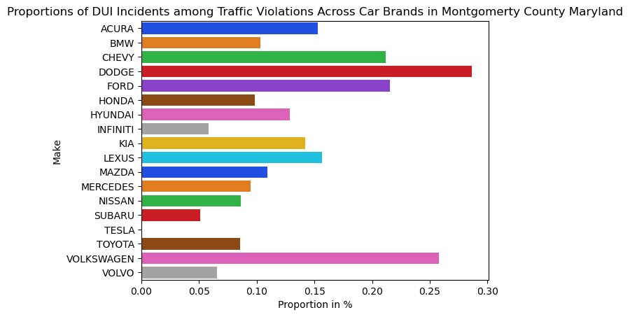
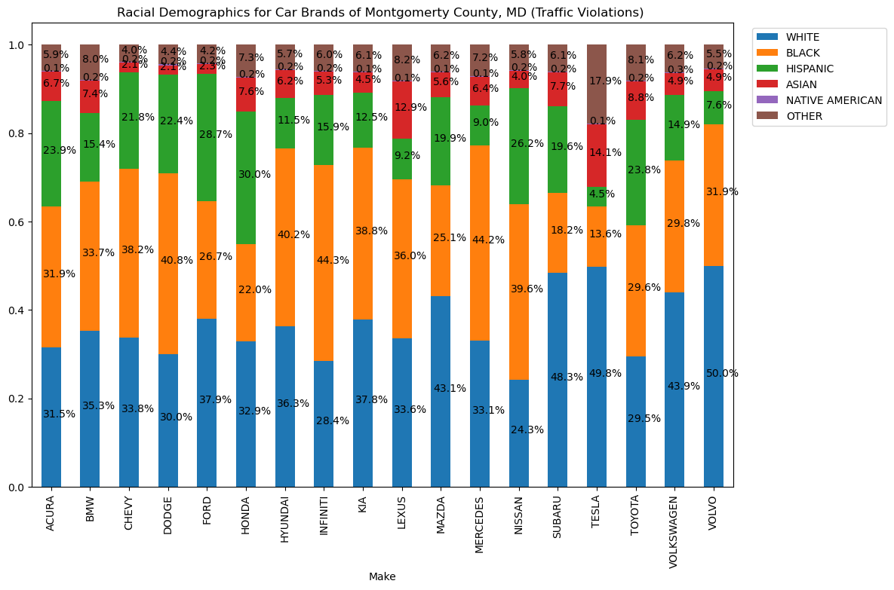

# Logan Kentner - Portfolio 
## About me 
Hello, I am Logan Kentner, a Junior Actuarial Science Major and Data Science minor at Saint Joseph's University. I am very interested in working in Data Science and Analytics, and I created this website to display projects and homework from my classes in Statistical Regressions and Data Science. I also created it to display personal projects where I apply and practice the skills I've learned in Data Cleaning, Exploratory Data Analysis, Data Visualization, and Modeling.
## Technical Skills
-Python: Pandas, NumPy, scikit-learn
-R

## Projects
[DSC 325: Intro to Data Science Final Project](FINAL_PROJECT_CODE.md) 
For this project, my partner and I found a large dataset detailing transactions on a Venmo-like app. We performed Data Cleaning since the data was so unprocessed, and then EDA to visualize trends and possible relations. We decided to see if we could produce a model that would be able to predict the binary classification of IsFraud, based on numeric predictors that worked best in the EDA like OriginalBalance and TransferAmount. For the model, we opted to utilize an Artificial Neural Network(ANN) so we wouldn't have to conform to assumptions like with Regression. 

[Maryland Traffic Violations Data Analysis](Data-Science-Project-MarylandTroublemakers.md)
This is a personal project where I wanted to try an analysis of a large and raw dataset, I found this dataset of Traffic Violations in Montgomery County, MD on a government website. The dataset had over 1.8 million rows and contained many missing values, user input categories, and unnecessary columns. The majority of the time on this project was spent correcting those issues, by recoding Car Makes and removing missing variables and bad columns. The variables were almost all categorical so I mostly stuck to doing visualizations and analyzing trends and relationships from there. 

